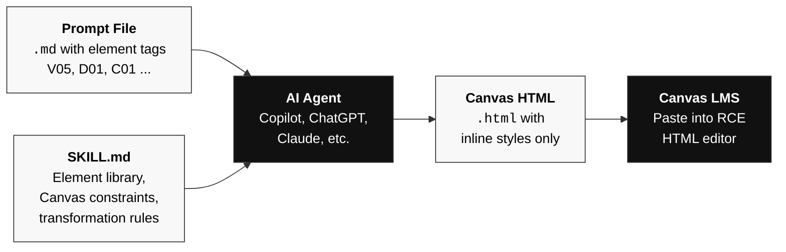

# Canvas Design Agent

A portable skill and reference system that transforms plain text into Canvas LMS-compatible HTML. 

[Documentation Site](https://npuckett.github.io/canvas-design-agent/docs/) · [Element Catalog](https://npuckett.github.io/canvas-design-agent/docs/elements.html) · [Examples](https://npuckett.github.io/canvas-design-agent/docs/examples.html) · [Guide](https://npuckett.github.io/canvas-design-agent/docs/guide.html) · [About](https://npuckett.github.io/canvas-design-agent/docs/about.html)

## Table of Contents

- [How It Works: Prompt Files](#how-it-works-prompt-files)
- [What This Is](#what-this-is)
- [Getting the Skill](#getting-the-skill)
- [Quick Start](#quick-start)
- [Example Prompt Files](#example-prompt-files)
- [Example Page Structure](#example-page-structure)
- [File Structure](#file-structure)
- [Documentation Site](#documentation-site)
- [Element Numbering System](#element-numbering-system)
- [Canvas Constraints (Summary)](#canvas-constraints-summary)
- [License](#license)

## How It Works: Prompt Files

The core workflow is writing a **prompt file** -- a plain markdown file that describes what you want on a Canvas page. You reference elements by their ID (e.g., V05, D01, C01) and the agent generates a Canvas-safe HTML file.

The general workflow:

1. Write a `.md` prompt file describing your page content and referencing element IDs.
2. The agent reads your prompt file plus SKILL.md and generates an `.html` file with inline styles.
3. You keep both files in your project -- the prompt as the editable source, the HTML as the generated output.
4. Copy the HTML into Canvas RCE whenever you need to publish or update the page.



Here's a minimal prompt file:

```markdown
# Week 3 Class Page

Use V02 blue header, C06 agenda list, C01 collapsible for resources.

## Header
Class 03: Sensor Fundamentals
CART 310 · Week 3 · September 22, 2026

## Agenda
1. Review: Input/Output exercise (10 min)
2. Lecture: Sensor types and applications (40 min)
3. Break (10 min)
4. Lab: Sensor workshop (60 min)

## Resources (collapsible)
- Slides: sensor-fundamentals.pdf
- Arduino sensor starter kit docs
- Recommended: Igoe, "Making Things Talk" Ch. 4
```

The agent reads this file plus SKILL.md, and outputs a complete `.html` file with inline styles that works in Canvas. When your content changes, edit the prompt file and regenerate.

## What This Is

Canvas LMS strips most CSS (no `<style>` blocks, no external stylesheets, no JavaScript) and many HTML elements. Only inline `style=""` attributes and specific HTML elements survive the Rich Content Editor (RCE). This project provides:

1. **[SKILL.md](.github/SKILL.md)** -- An agent instruction file containing Canvas constraints, a numbered element library, and transformation rules. Works with any LLM.
2. **[Reference Website](https://npuckett.github.io/canvas-design-agent/)** -- A visual catalog of every available element, step-by-step workflow instructions, and a methods guide for creating course-specific templates.

## Getting the Skill

**Option A: Clone / download the whole repo** (recommended if you want the reference site and examples too):

```
git clone https://github.com/npuckett/canvas-design-agent.git
```

Open the folder in VS Code (or your editor). The skill file lives at `.github/SKILL.md` and is automatically picked up by editors that read instruction files from that location (VS Code with Copilot, Cursor, Windsurf, etc.). You can start writing content files immediately.

**Option B: Download only the skill file:**

If you already have a project and just need the skill, download [SKILL.md](.github/SKILL.md) and place it in your project's `.github/` directory. That's the only file the agent needs.

## Quick Start

### Workflow A: Local Agent (VS Code with Copilot, Cursor, etc.)

1. Clone this repo (or copy [`.github/SKILL.md`](.github/SKILL.md) into your own project's `.github/` folder).
2. Open the project folder in your editor. The agent will automatically read the skill file.
3. Create a `.md` prompt file with your course content and element references (see [How It Works: Prompt Files](#how-it-works-prompt-files) below).
4. Ask the agent to generate a Canvas HTML file: *"Transform this into a Canvas HTML file using the skill."*
5. The agent writes an `.html` file in your project. Preview it in a browser and keep it under version control.
6. Open the generated HTML file, copy its contents into Canvas RCE (switch to HTML editor view), and save.

### Workflow B: Web-Based Agent (ChatGPT, Claude, Gemini, etc.)

1. Upload [`.github/SKILL.md`](.github/SKILL.md) to the conversation (or paste its contents).
2. Upload or paste your plain text content with element references.
3. Ask the agent to generate Canvas HTML using the skill instructions.
4. Save the generated HTML as an `.html` file in your project for reference and reuse.
5. Open the HTML file, copy its contents into Canvas RCE (switch to HTML editor view), and save.

> **See also:** The [Guide](https://npuckett.github.io/canvas-design-agent/docs/guide.html) on the docs site walks through both workflows in detail, with template examples and a comparison table.

## Example Prompt Files

These example prompt files show the markdown input that generates each example page. View them to see the format, then adapt them for your own courses:

| Prompt File | Generated Example | Key Elements |
|---|---|---|
| [course-timeline.md](docs/prompts/course-timeline.md) | [Course Timeline](https://npuckett.github.io/canvas-design-agent/docs/example-course-timeline.html) | V05, D05, D07, C01 |
| [class-page.md](docs/prompts/class-page.md) | [Class Page](https://npuckett.github.io/canvas-design-agent/docs/example-class-page.html) | V02, L03, C06, C01 |
| [project-brief.md](docs/prompts/project-brief.md) | [Project Brief](https://npuckett.github.io/canvas-design-agent/docs/example-project-brief.html) | V05, L04, D01, D07 |
| [gallery-page.md](docs/prompts/gallery-page.md) | [External Media Gallery](https://npuckett.github.io/canvas-design-agent/docs/example-external-media.html) | E01, E02, E03, L03, C01 |

See the [Prompt Files section](https://npuckett.github.io/canvas-design-agent/docs/guide.html#prompt-files) of the Guide for a full explanation of the format and tips for writing effective prompts.

## Example Page Structure

Every generated example HTML page follows the same two-part structure: a **documentation wrapper** (site navigation, hero, description) and a **Canvas preview** containing only inline-styled HTML that works in Canvas RCE.

See [docs/example-structure.md](docs/example-structure.md) for a detailed breakdown of each section, the CSS conventions, how the four examples differ, and instructions for creating new example pages.

## Documentation Site

The full reference site is hosted on GitHub Pages:

**[npuckett.github.io/canvas-design-agent/docs](https://npuckett.github.io/canvas-design-agent/docs/)**

The site includes:
- **[Element Catalog](https://npuckett.github.io/canvas-design-agent/docs/elements.html)** -- Visual preview of every Canvas-safe HTML element with its ID number
- **[Examples](https://npuckett.github.io/canvas-design-agent/docs/examples.html)** -- Four full page examples (course timeline, class page, project brief, external media gallery) showing realistic Canvas pages built from the element library
- **[Guide](https://npuckett.github.io/canvas-design-agent/docs/guide.html)** -- Step-by-step workflows for both local and web-based agents, course templates, prompt file format, and a constraints quick reference
- **[About](https://npuckett.github.io/canvas-design-agent/docs/about.html)** -- About this project and its author

You can also run the site locally by opening `docs/index.html` in a browser.

## Element Numbering System

Elements are organized by category with a letter prefix:

| Prefix | Category | Count |
|--------|----------|-------|
| L | Layout | 6 |
| C | Content Organization | 8 |
| T | Typography | 9 |
| D | Data Display | 7 |
| V | Visual Indicators | 6 |
| N | Navigation | 2 |
| X | Canvas Integration | 6 |
| E | External Media | 3 |

Faculty reference elements by number (e.g., "use C01 for collapsible sections"). The agent knows the corresponding HTML.

## Canvas Constraints (Summary)

**Works (inline style only):** flexbox, grid, gradients, relative/absolute positioning, overflow, max-width centering, details/summary, mark, abbr, definition lists, all table features, audio/video controls.

**Stripped:** `<style>` blocks, `<script>`, SVG, meter/progress, fieldset/legend, box-shadow, text-shadow, opacity, transform, letter-spacing, external CSS/JS, data URIs.

See [SKILL.md](.github/SKILL.md) for the complete constraint reference, or the [Constraints section](https://npuckett.github.io/canvas-design-agent/docs/guide.html#constraints) on the docs site.

## License

[Creative Commons Attribution-NonCommercial-ShareAlike 4.0 International](LICENSE) (CC BY-NC-SA 4.0)

Free to use, share, and adapt for academic and non-commercial purposes. Attribution required. Derivatives must use the same license. Commercial use is not permitted.
