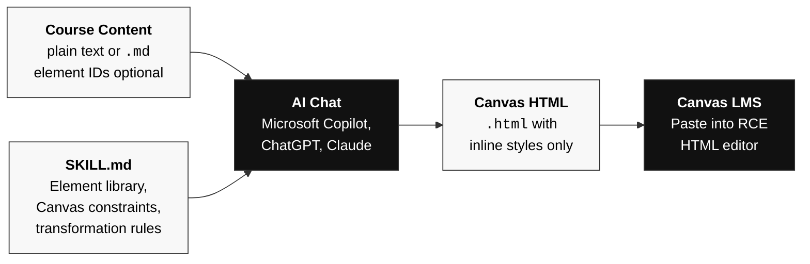

# Canvas Design Agent

A portable skill and reference system that transforms plain text into Canvas LMS-compatible HTML. The easiest workshop workflow is web-based: upload `SKILL.md` to Microsoft Copilot, ChatGPT, or Claude, paste course content, and ask for Canvas-ready HTML.

[Documentation Site](https://npuckett.github.io/canvas-design-agent/docs/) · [Download SKILL.md](https://npuckett.github.io/canvas-design-agent/docs/downloads/SKILL.md) · [Methods](https://npuckett.github.io/canvas-design-agent/docs/methods.html) · [Outputs](https://npuckett.github.io/canvas-design-agent/docs/outputs.html) · [Element Catalog](https://npuckett.github.io/canvas-design-agent/docs/elements.html) · [Examples](https://npuckett.github.io/canvas-design-agent/docs/examples.html) · [Guide](https://npuckett.github.io/canvas-design-agent/docs/guide.html)

## Table of Contents

- [How It Works: Prompt Files](#how-it-works-prompt-files)
- [What This Is](#what-this-is)
- [Getting the Skill](#getting-the-skill)
- [Quick Start](#quick-start)
- [Interaction Methods](#interaction-methods)
- [Input and Output Types](#input-and-output-types)
- [Downloads](#downloads)
- [Prompt Templates](#prompt-templates)
- [Example Page Structure](#example-page-structure)
- [Documentation Site](#documentation-site)
- [Element Numbering System](#element-numbering-system)
- [Canvas Constraints (Summary)](#canvas-constraints-summary)
- [License](#license)

## How It Works: Prompt Files

The core workflow is writing plain-text course content and giving it to an AI chat along with `SKILL.md`. Faculty can use a formal `.md` prompt file, but they can also paste rough notes directly into Microsoft Copilot, ChatGPT, or Claude.

The beginner workflow:

1. Upload or paste `SKILL.md` into a web-based AI chat.
2. Paste course content in plain language.
3. Ask the AI to generate a Canvas HTML fragment with inline styles.
4. Copy the HTML into the Canvas Rich Content Editor HTML view.

The reusable workflow:

1. Save the content as a `.md` prompt file.
2. Regenerate the Canvas HTML whenever the source content changes.
3. Keep the prompt as the editable source and the generated HTML as the paste-ready output.


```mermaid
flowchart LR
    A["<b>Course Content</b><br/>plain text or <code>.md</code><br/>element IDs optional"] --> C["<b>AI Chat</b><br/>Microsoft Copilot,<br/>ChatGPT, Claude"]
    B["<b>SKILL.md</b><br/>Element library,<br/>Canvas constraints,<br/>transformation rules"] --> C
    C --> D["<b>Canvas HTML</b><br/><code>.html</code> with<br/>inline styles only"]
    D --> E["<b>Canvas LMS</b><br/>Paste into RCE<br/>HTML editor"]

    style A fill:#f8f8f8,stroke:#333,color:#000
    style B fill:#f8f8f8,stroke:#333,color:#000
    style C fill:#111,stroke:#333,color:#fff
    style D fill:#f8f8f8,stroke:#333,color:#000
    style E fill:#111,stroke:#333,color:#fff
```

Here's a minimal prompt file:

```markdown
# Week 3 Class Page

Transform this into a Canvas page using the Canvas Design Agent skill.
Use the default Clean Modern style and a readable single-column layout.

## Header
Class 03: Sensor Fundamentals
CART 310 · Week 3 · September 22, 2026

## Agenda
1. Review: Input/Output exercise (10 min)
2. Lecture: Sensor types and applications (40 min)
3. Break (10 min)
4. Lab: Sensor workshop (60 min)

## Resources (collapsible)
- Slides: sensor-fundamentals.pdf
- Arduino sensor starter kit docs
- Recommended: Igoe, "Making Things Talk" Ch. 4
```

The agent reads this content plus `SKILL.md`, then outputs Canvas-ready HTML with inline styles. When your content changes, edit the prompt and regenerate.

## What This Is

Canvas LMS strips most CSS (no `<style>` blocks, no external stylesheets, no JavaScript) and many HTML elements. Only inline `style=""` attributes and specific HTML elements survive the Rich Content Editor (RCE). This project provides:

1. **[SKILL.md](.github/SKILL.md)** -- A portable instruction file containing Canvas constraints, a numbered element library, and transformation rules. It can be uploaded or pasted into web-based AI chats.
2. **[Public Skill Download](docs/downloads/SKILL.md)** -- A docs-hosted copy of the skill file for workshop-friendly download links.
3. **[Reference Website](https://npuckett.github.io/canvas-design-agent/docs/)** -- A complete documentation site with start-here guidance, step-by-step methods, output type guidance, downloads, examples, and the element catalog.
4. **[Prompt Templates](docs/prompts/)** -- Markdown source examples for common Canvas page types.

## Getting the Skill

**Option A: Use the web workshop path** (recommended for most faculty):

1. Download [SKILL.md](docs/downloads/SKILL.md) from the public docs download copy.
2. Open Microsoft Copilot, ChatGPT, or Claude.
3. Upload `SKILL.md`. If upload is not available, paste the file contents into the chat.
4. Paste your course content and ask for Canvas-ready HTML.

**Option B: Clone / download the whole repo** (recommended if you want the reference site and examples too):

```
git clone https://github.com/npuckett/canvas-design-agent.git
```

Open the folder in your editor if you want to manage prompt files and generated HTML locally. Local agent behavior varies by editor, so the web upload path above is the most reliable beginner workflow.

**Option C: Download only the skill file for a local project:**

If you already have a project and just need the skill, download [SKILL.md](docs/downloads/SKILL.md). The canonical source remains [.github/SKILL.md](.github/SKILL.md). You can upload the public copy to a web chat, paste it into a conversation, or place it wherever your local AI editor expects reusable instructions.

## Quick Start

### New to This? Start Here (No HTML Knowledge Required)

1. Download [SKILL.md](docs/downloads/SKILL.md).
2. Open Microsoft Copilot in your browser. ChatGPT or Claude can also work.
3. Upload or paste the contents of SKILL.md into the conversation.
4. Type or paste your course content in plain text — just describe your page naturally. (See [simple-syllabus.md](docs/prompts/simple-syllabus.md) for an example that uses zero element IDs.)
5. Tell the agent: *"Use the uploaded Canvas Design Agent skill. Transform this into a Canvas-ready HTML fragment using inline styles only. Do not include html, head, body, style, or script tags."*
6. Copy the generated HTML, open your Canvas page, click the HTML editor icon (`</>` in the toolbar), paste, and save.

That's it. The agent handles the formatting. See the [Your First Page walkthrough](https://npuckett.github.io/canvas-design-agent/docs/guide.html#first-page) on the docs site for a detailed step-by-step.

### Workflow A: Web-Based Agent (Recommended For Workshops)

1. Upload [`docs/downloads/SKILL.md`](docs/downloads/SKILL.md) to Microsoft Copilot, ChatGPT, or Claude, or paste its contents into a new chat.
2. Paste your plain text course content.
3. Ask the agent to generate Canvas HTML using the skill instructions.
4. Copy the HTML fragment.
5. Paste it into Canvas RCE's HTML editor view and save.

### Workflow B: Local Agent (Advanced)

1. Clone this repo (or copy [`.github/SKILL.md`](.github/SKILL.md) into your own project's `.github/` folder).
2. Open the project folder in your editor. Confirm your editor can read the skill or instruction file from that location.
3. Create a `.md` prompt file with your course content and element references (see [How It Works: Prompt Files](#how-it-works-prompt-files) below).
4. Ask the agent to generate a Canvas HTML file: *"Transform this into a Canvas HTML file using the skill."*
5. The agent writes an `.html` file in your project. Preview it in a browser and keep it under version control.
6. Open the generated HTML file, copy its contents into Canvas RCE (switch to HTML editor view), and save.

> **See also:** The [Methods](https://npuckett.github.io/canvas-design-agent/docs/methods.html) page walks through web chat, prompt files, local AI editors, component sketching, and Canvas paste/review workflows.

## Interaction Methods

The documentation site now treats methods as first-class documentation rather than workshop-only handouts:

- **[Web Chat](https://npuckett.github.io/canvas-design-agent/docs/methods.html#web-chat)** -- upload or paste `SKILL.md`, paste course content, and ask for Canvas HTML.
- **[Prompt Files](https://npuckett.github.io/canvas-design-agent/docs/methods.html#prompt-file)** -- keep reusable markdown sources that regenerate Canvas pages.
- **[Local AI Editor](https://npuckett.github.io/canvas-design-agent/docs/methods.html#local-agent)** -- manage prompts and generated HTML in a local course project.
- **[Component Sketching](https://npuckett.github.io/canvas-design-agent/docs/methods.html#component-sketching)** -- compare 3-4 tagged Canvas-safe options before generating a full page.
- **[Canvas Paste and Review](https://npuckett.github.io/canvas-design-agent/docs/methods.html#canvas-review)** -- check that the saved Canvas page survived RCE sanitization.

## Input and Output Types

Use the [Outputs](https://npuckett.github.io/canvas-design-agent/docs/outputs.html) page to decide what to give the skill and what to ask it to produce.

Common input types include rough notes, markdown prompt files, element ID requests, course templates, media URLs, and existing Canvas HTML. Common output types include Canvas HTML fragments, component sketch options, reusable prompt files, course page templates, assignment pages, timelines, media galleries, and revision prompts.

## Downloads

The [Downloads](https://npuckett.github.io/canvas-design-agent/docs/downloads.html) page is the public asset hub. It includes:

- [SKILL.md](docs/downloads/SKILL.md) for web chat and local AI workflows
- prompt templates from [docs/prompts](docs/prompts/)
- links from each downloadable asset to the relevant method documentation

Workshop-specific handouts can be built around these docs, but the durable source of truth is now the web documentation.

## Prompt Templates

These example prompt files show the markdown input that generates each example page. View them to see the format, then adapt them for your own courses:

| Prompt File | Generated Example | Key Elements |
|---|---|---|
| [simple-syllabus.md](docs/prompts/simple-syllabus.md) | *(beginner — no element IDs)* | Agent's choice |
| [course-timeline.md](docs/prompts/course-timeline.md) | [Course Timeline](https://npuckett.github.io/canvas-design-agent/docs/example-course-timeline.html) | V05, D05, D07, C01 |
| [class-page.md](docs/prompts/class-page.md) | [Class Page](https://npuckett.github.io/canvas-design-agent/docs/example-class-page.html) | V02, L03, C06, C01 |
| [project-brief.md](docs/prompts/project-brief.md) | [Project Brief](https://npuckett.github.io/canvas-design-agent/docs/example-project-brief.html) | V05, L04, D01, D07 |
| [gallery-page.md](docs/prompts/gallery-page.md) | [External Media Gallery](https://npuckett.github.io/canvas-design-agent/docs/example-external-media.html) | E01, E02, E03, L03, C01 |
| [homepage.md](docs/prompts/homepage.md) | [Course Homepage](https://npuckett.github.io/canvas-design-agent/docs/example-homepage.html) | S03, V05, N02, L03, D05 |
| [assignment-page.md](docs/prompts/assignment-page.md) | [Assignment Page](https://npuckett.github.io/canvas-design-agent/docs/example-assignment.html) | S06, F03, C01, D01, C05 |

See the [Downloads page](https://npuckett.github.io/canvas-design-agent/docs/downloads.html#prompts) for template descriptions and the [Prompt Files section](https://npuckett.github.io/canvas-design-agent/docs/guide.html#prompt-files) of the Guide for format tips.

## Example Page Structure

The example HTML pages on the documentation site use a two-part structure: a **documentation wrapper** (site navigation, hero, description) and a **Canvas preview** containing only inline-styled HTML. The [docs/example-structure.md](docs/example-structure.md) file documents this structure for contributors who want to add new examples to the reference site.

> **Note:** This is developer documentation about the reference site's HTML structure — you don't need to read it to use the skill.

## Documentation Site

The full reference site is hosted on GitHub Pages:

**[npuckett.github.io/canvas-design-agent/docs](https://npuckett.github.io/canvas-design-agent/docs/)**

The site includes:
- **[Downloads](https://npuckett.github.io/canvas-design-agent/docs/downloads.html)** -- Public `SKILL.md` download and prompt templates grouped by use case
- **[Methods](https://npuckett.github.io/canvas-design-agent/docs/methods.html)** -- Step-by-step workflows for web chat, prompt files, local agents, component sketching, and Canvas paste/review
- **[Outputs](https://npuckett.github.io/canvas-design-agent/docs/outputs.html)** -- Input types, output types, and common Canvas page archetypes
- **[Element Catalog](https://npuckett.github.io/canvas-design-agent/docs/elements.html)** -- Visual preview of every Canvas-safe HTML element with its ID number
- **[Examples](https://npuckett.github.io/canvas-design-agent/docs/examples.html)** -- Six full page examples (course timeline, class page, project brief, external media gallery, course homepage, assignment page) showing realistic Canvas pages built from the element library
- **[Guide](https://npuckett.github.io/canvas-design-agent/docs/guide.html)** -- Start-here walkthrough, prompt file format, course templates, constraints, themes, and troubleshooting
- **[About](https://npuckett.github.io/canvas-design-agent/docs/about.html)** -- About this project and its author

You can also run the site locally by opening `docs/index.html` in a browser.

## Element Numbering System

Elements are organized by category with a letter prefix:

| Prefix | Category | Count |
|--------|----------|-------|
| L | Layout | 8 |
| C | Content Organization | 9 |
| T | Typography | 10 |
| D | Data Display | 7 |
| V | Visual Indicators | 6 |
| N | Navigation | 2 |
| X | Canvas Integration | 6 |
| E | External Media | 3 |
| S | Style Themes | 7 |
| F | Font Stacks | 5 |

Faculty reference elements by number (e.g., "use C01 for collapsible sections"). The agent knows the corresponding HTML.

## Canvas Constraints (Summary)

**Works (inline style only):** flexbox, grid, gradients, relative/absolute positioning, overflow, max-width centering, details/summary, mark, abbr, definition lists, all table features, audio/video controls.

**Stripped:** `<style>` blocks, `<script>`, SVG, meter/progress, fieldset/legend, box-shadow, text-shadow, opacity, transform, letter-spacing, external CSS/JS, data URIs.

See [SKILL.md](.github/SKILL.md) for the canonical constraint reference, the public [download copy](docs/downloads/SKILL.md), or the [Constraints section](https://npuckett.github.io/canvas-design-agent/docs/guide.html#constraints) on the docs site.

## License

[Creative Commons Attribution-NonCommercial-ShareAlike 4.0 International](LICENSE) (CC BY-NC-SA 4.0)

Free to use, share, and adapt for academic and non-commercial purposes. Attribution required. Derivatives must use the same license. Commercial use is not permitted.
