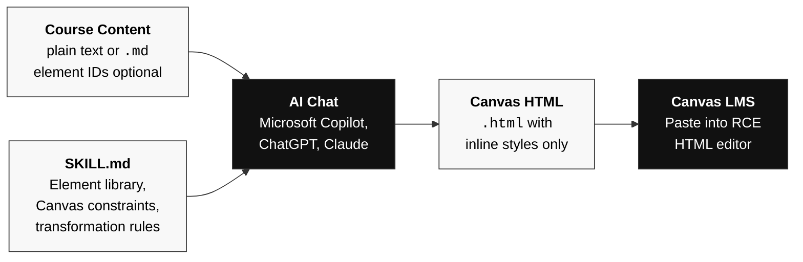

# Canvas Design Agent

A portable skill and reference system that transforms plain text into Canvas LMS-compatible HTML. The easiest workshop workflow is web-based: paste or upload `SKILL.md` in Microsoft Copilot, ChatGPT, or Claude, wait for the built-in starter prompt, then paste course content.

[Documentation Site](https://npuckett.github.io/canvas-design-agent/docs/) · [Download SKILL.md](https://npuckett.github.io/canvas-design-agent/docs/downloads/SKILL.md) · [Workflows](https://npuckett.github.io/canvas-design-agent/docs/workflows.html) · [Element Catalog](https://npuckett.github.io/canvas-design-agent/docs/elements.html) · [Examples](https://npuckett.github.io/canvas-design-agent/docs/examples.html) · [Downloads](https://npuckett.github.io/canvas-design-agent/docs/downloads.html)

## Table of Contents

- [Course Repos: The Recommended Workflow](#course-repos-the-recommended-workflow)
- [Bulk Course Creation (No Copy/Paste)](#bulk-course-creation-no-copypaste)
- [How It Works: Prompt Files](#how-it-works-prompt-files)
- [What This Is](#what-this-is)
- [Getting the Skill](#getting-the-skill)
- [Quick Start](#quick-start)
- [Three Ways Into Canvas](#three-ways-into-canvas)
- [Input and Output Types](#input-and-output-types)
- [Downloads](#downloads)
- [Prompt Templates](#prompt-templates)
- [Example Page Structure](#example-page-structure)
- [Documentation Site](#documentation-site)
- [Element Numbering System](#element-numbering-system)
- [Canvas Constraints (Summary)](#canvas-constraints-summary)
- [License](#license)

## Course Repos: The Recommended Workflow

Web chat is the easiest way to try the skill, but the more reasonable workflow for actually managing a course is a **course repo**: one folder (ideally under git) that holds your whole course as small text files, driven by an AI coding agent (Claude Code, Cursor, VS Code + Copilot) instead of a chat window. The repo — not Canvas — becomes the source of truth:

- Your **customizations live in the repo** — a `style.md` captures your course's theme, colors, and recurring page sections, and `CLAUDE.md` tells the agent to apply them, so every generated page is consistent without re-explaining.
- **Course-wide changes are one instruction** — "shift all due dates a week later", "restyle every class page" — the agent edits many files, you review the diff, rebuild, re-import.
- **Next semester is a copy of the folder** with new dates.

Start from the **[canvas-course-template](https://github.com/npuckett/canvas-course-template)** repository — a self-contained starter with the skill file, build tools, agent instructions, style template, and starter content. Click **"Use this template"** on GitHub to create your own course repo, or grab a copy without an account:

```bash
npx degit npuckett/canvas-course-template my-course
```

Open it in your AI coding tool and describe your course; build with `python3 tools/build_imscc.py . -o dist/course.imscc` and import into Canvas. See the [template README](https://github.com/npuckett/canvas-course-template#readme) and the [Workflows page](https://npuckett.github.io/canvas-design-agent/docs/workflows.html#course-repo). (The template's source of truth lives in this repo at [course-template/](course-template/).)

## Bulk Course Creation (No Copy/Paste)

Copy/paste works for single pages, but whole courses can now be built and updated in bulk. The [tools/](tools/) folder contains dependency-free Python scripts that turn a folder of markdown files into a Canvas-importable course package (`.imscc`) — every assignment (points, due dates, submission types, grading type), assignment groups with grade weights and drop rules, wiki pages, modules, the syllabus, and the course front page, all in one import:

```bash
python3 tools/build_imscc.py my-course        # folder of .md files -> my-course.imscc
```

Then in Canvas: **Settings → Import Course Content → Canvas Course Export Package**. Identifiers are stable across rebuilds, so editing your markdown and re-importing updates content in place instead of duplicating it.

Also included:

- `extract_imscc.py` — turn an existing Canvas course export back into the editable markdown folder (bootstrap next semester's course from this one)
- `canvas_api_sync.py` — push individual page/assignment edits straight into Canvas over the REST API, no import step at all (needs an access token)

See [tools/README.md](tools/README.md) for the folder format, a comparison of the three ways to get HTML into Canvas, and a worked example course in [tools/example-course/](tools/example-course/).

## How It Works: Prompt Files

The core workflow is writing plain-text course content and giving it to an AI chat along with `SKILL.md`. Faculty can use a formal `.md` prompt file, but they can also paste rough notes directly into Microsoft Copilot, ChatGPT, or Claude.

The beginner workflow:

1. Paste or upload `SKILL.md` into a web-based AI chat. The top of the file tells the AI to treat it as instructions and reply when ready.
2. Paste course content in plain language.
3. Ask for any preferences not already included in the content. The skill will create Canvas HTML source with inline styles and use a downloadable `canvas-fragment.html` source file when the tool supports files or artifacts.
4. Copy the HTML source, not a rendered preview, into the Canvas Rich Content Editor HTML view.

The reusable workflow:

1. Save the content as a `.md` prompt file.
2. Regenerate the Canvas HTML whenever the source content changes.
3. Keep the prompt as the editable source and the generated HTML as the paste-ready output.


```mermaid
flowchart LR
    A["<b>Course Content</b><br/>plain text or <code>.md</code><br/>element IDs optional"] --> C["<b>AI Chat</b><br/>Microsoft Copilot,<br/>ChatGPT, Claude"]
    B["<b>SKILL.md</b><br/>Element library,<br/>Canvas constraints,<br/>transformation rules"] --> C
    C --> D["<b>Canvas HTML</b><br/><code>.html</code> with<br/>inline styles only"]
    D --> E["<b>Canvas LMS</b><br/>Paste into RCE<br/>HTML editor"]

    style A fill:#f8f8f8,stroke:#333,color:#000
    style B fill:#f8f8f8,stroke:#333,color:#000
    style C fill:#111,stroke:#333,color:#fff
    style D fill:#f8f8f8,stroke:#333,color:#000
    style E fill:#111,stroke:#333,color:#fff
```

Here's a minimal prompt file:

```markdown
# Week 3 Class Page

Transform this into a Canvas page using the Canvas Design Agent skill.
Use the default Clean Modern style and a readable single-column layout.

## Header
Class 03: Sensor Fundamentals
CART 310 · Week 3 · September 22, 2026

## Agenda
1. Review: Input/Output exercise (10 min)
2. Lecture: Sensor types and applications (40 min)
3. Break (10 min)
4. Lab: Sensor workshop (60 min)

## Resources (collapsible)
- Slides: sensor-fundamentals.pdf
- Arduino sensor starter kit docs
- Recommended: Igoe, "Making Things Talk" Ch. 4
```

The agent reads this content plus `SKILL.md`, then outputs Canvas-ready HTML with inline styles. When your content changes, edit the prompt and regenerate.

## What This Is

Canvas LMS strips most CSS (no `<style>` blocks, no external stylesheets, no JavaScript) and many HTML elements. Only inline `style=""` attributes and specific HTML elements survive the Rich Content Editor (RCE). This project provides:

1. **[SKILL.md](.github/SKILL.md)** -- A portable instruction file containing Canvas constraints, a numbered element library, and transformation rules. It can be uploaded or pasted into web-based AI chats.
2. **[Public Skill Download](docs/downloads/SKILL.md)** -- A docs-hosted copy of the skill file for workshop-friendly download links.
3. **[Reference Website](https://npuckett.github.io/canvas-design-agent/docs/)** -- A complete documentation site with start-here guidance, step-by-step methods, output type guidance, downloads, examples, and the element catalog.
4. **[Prompt Templates](docs/prompts/)** -- Markdown source examples for common Canvas page types.
5. **[Course-Building Tools](tools/)** -- Dependency-free Python scripts that package a folder of markdown files into a Canvas-importable `.imscc` course (assignments with grading, weighted groups, pages, modules, syllabus), extract existing Canvas exports back into editable files, and sync content over the Canvas REST API.
6. **[Course Repo Template](https://github.com/npuckett/canvas-course-template)** -- A self-contained GitHub template repository ("Use this template" button) for managing a course as a repo with an AI coding agent: skill file, tools, agent instructions, and a course style template. Maintained here in [course-template/](course-template/).

## Getting the Skill

**Option A: Use the web workshop path** (recommended for most faculty):

1. Download [SKILL.md](docs/downloads/SKILL.md) from the public docs download copy.
2. Open Microsoft Copilot, ChatGPT, or Claude.
3. Paste the contents of `SKILL.md` into the chat, or upload the file if your tool handles uploads well. The top of the file includes the starter prompt for the AI.
4. When the AI says it is ready, paste your course content and ask for Canvas-ready HTML.

**Option B: Clone / download the whole repo** (recommended if you want the reference site and examples too):

```
git clone https://github.com/npuckett/canvas-design-agent.git
```

Open the folder in your editor if you want to manage prompt files and generated HTML locally. Local agent behavior varies by editor, so the web upload path above is the most reliable beginner workflow.

**Option C: Download only the skill file for a local project:**

If you already have a project and just need the skill, download [SKILL.md](docs/downloads/SKILL.md). The canonical source remains [.github/SKILL.md](.github/SKILL.md). You can upload the public copy to a web chat, paste it into a conversation, or place it wherever your local AI editor expects reusable instructions.

## Quick Start

### New to This? Start Here (No HTML Knowledge Required)

1. Download [SKILL.md](docs/downloads/SKILL.md).
2. Open Microsoft Copilot in your browser. ChatGPT or Claude can also work.
3. Paste the contents of SKILL.md into the conversation, or upload the file if your tool handles uploads well. The file begins with a starter prompt that tells the AI to treat it as instructions.
4. Wait for the AI's ready message, then type or paste your course content in plain text — just describe your page naturally. (See [simple-syllabus.md](docs/prompts/simple-syllabus.md) for an example that uses zero element IDs.)
5. Add any preferences you want, such as a theme, layout, or element ID. The skill already tells the AI to create Canvas-ready HTML source with inline styles and to use a downloadable canvas-fragment.html source file when possible.
6. Copy the HTML source from the file or code block, open your Canvas page, click the HTML editor icon (`</>` in the toolbar), paste, and save.

That's it. The agent handles the formatting. See the [Copy & Paste walkthrough](https://npuckett.github.io/canvas-design-agent/docs/workflows.html#paste) on the docs site for a detailed step-by-step.

### Workflow A: Web-Based Agent (Recommended For Workshops)

1. Paste the contents of [`docs/downloads/SKILL.md`](docs/downloads/SKILL.md) into Microsoft Copilot, ChatGPT, or Claude, or upload the file if your tool handles uploads well.
2. Wait for the ready message from the starter prompt at the top of the file, then paste your plain text course content.
3. Ask for any page preferences you want. The skill instructions generate Canvas HTML source and use a downloadable `canvas-fragment.html` file or artifact when the tool supports it.
4. Copy the HTML source, not the rendered preview.
5. Paste it into Canvas RCE's HTML editor view and save.

### Workflow B: Course Repo with a Local Agent (Recommended for Managing a Course)

1. Create your course repo from [canvas-course-template](https://github.com/npuckett/canvas-course-template) — "Use this template" on GitHub, or `npx degit npuckett/canvas-course-template my-course` (see [Course Repos](#course-repos-the-recommended-workflow) above). It ships with `SKILL.md`, the build tools, and `CLAUDE.md` agent instructions.
2. Open the folder in your AI coding tool (Claude Code, Cursor, VS Code + Copilot). The agent picks up the instructions automatically.
3. Fill in `course.md` (title, code, timezone), `groups.md` (grading scheme), and `style.md` (your course's look and recurring sections) — or just describe them to the agent.
4. Give the agent your course content in plain language: *"Create class pages for weeks 1–6 from these notes."* It writes one markdown file per page/assignment, with Canvas-safe HTML inside.
5. Build the import package: `python3 tools/build_imscc.py . -o dist/course.imscc`
6. Canvas → Settings → Import Course Content → "Canvas Course Export Package". Re-import after edits to update in place — no copy/paste at any step.

> **See also:** The [Workflows](https://npuckett.github.io/canvas-design-agent/docs/workflows.html) page walks through all three paths for getting content into Canvas, with step-by-step instructions for each.

## Three Ways Into Canvas

However you generate the HTML, there are three ways to get it into your course — documented in full on the [Workflows](https://npuckett.github.io/canvas-design-agent/docs/workflows.html) page:

1. **[Copy & Paste](https://npuckett.github.io/canvas-design-agent/docs/workflows.html#paste)** -- paste generated HTML into the Canvas RCE HTML view (`</>` icon). No setup; one page at a time; assignment settings still set by hand in Canvas.
2. **[Course Package Import](https://npuckett.github.io/canvas-design-agent/docs/workflows.html#package)** -- build a `.imscc` package with [tools/build_imscc.py](tools/build_imscc.py) and import it via Settings → Import Course Content. Carries everything: pages, assignments with points/due dates/submission types/grading, weighted assignment groups, modules, and the syllabus. Re-imports update in place. Needs no special permissions.
3. **[Direct API Sync](https://npuckett.github.io/canvas-design-agent/docs/workflows.html#api)** -- push pages and assignments straight into Canvas with [tools/canvas_api_sync.py](tools/canvas_api_sync.py). Fully hands-off, but requires a Canvas access token (Account → Settings → "+ New Access Token" — some institutions disable this; the Workflows page shows how to check yours).

## Input and Output Types

Common input types include rough notes, markdown prompt files, element ID requests, course templates, media URLs, existing Canvas HTML, and full Canvas course exports (via [tools/extract_imscc.py](tools/extract_imscc.py)). Common output types include Canvas HTML fragments, component sketch options, reusable prompt files, course page templates, assignment pages, timelines, media galleries, and complete importable course packages.

## Downloads

The [Downloads](https://npuckett.github.io/canvas-design-agent/docs/downloads.html) page is the public asset hub. It includes:

- [SKILL.md](docs/downloads/SKILL.md) for web chat and local AI workflows
- prompt templates from [docs/prompts](docs/prompts/)
- links from each downloadable asset to the relevant method documentation

Workshop-specific handouts can be built around these docs, but the durable source of truth is now the web documentation.

## Prompt Templates

These example prompt files show the markdown input that generates each example page. View them to see the format, then adapt them for your own courses:

| Prompt File | Generated Example | Key Elements |
|---|---|---|
| [simple-syllabus.md](docs/prompts/simple-syllabus.md) | *(beginner — no element IDs)* | Agent's choice |
| [course-timeline.md](docs/prompts/course-timeline.md) | [Course Timeline](https://npuckett.github.io/canvas-design-agent/docs/example-course-timeline.html) | V05, D05, D07, C01 |
| [class-page.md](docs/prompts/class-page.md) | [Class Page](https://npuckett.github.io/canvas-design-agent/docs/example-class-page.html) | V02, L03, C06, C01 |
| [project-brief.md](docs/prompts/project-brief.md) | [Project Brief](https://npuckett.github.io/canvas-design-agent/docs/example-project-brief.html) | V05, L04, D01, D07 |
| [gallery-page.md](docs/prompts/gallery-page.md) | [External Media Gallery](https://npuckett.github.io/canvas-design-agent/docs/example-external-media.html) | E01, E02, E03, L03, C01 |
| [homepage.md](docs/prompts/homepage.md) | [Course Homepage](https://npuckett.github.io/canvas-design-agent/docs/example-homepage.html) | S03, V05, N02, L03, D05 |
| [assignment-page.md](docs/prompts/assignment-page.md) | [Assignment Page](https://npuckett.github.io/canvas-design-agent/docs/example-assignment.html) | S06, F03, C01, D01, C05 |

See the [Downloads page](https://npuckett.github.io/canvas-design-agent/docs/downloads.html) for template descriptions and the [How It Works: Prompt Files](#how-it-works-prompt-files) section above for format tips.

## Example Page Structure

The example HTML pages on the documentation site use a two-part structure: a **documentation wrapper** (site navigation, hero, description) and a **Canvas preview** containing only inline-styled HTML. The [docs/example-structure.md](docs/example-structure.md) file documents this structure for contributors who want to add new examples to the reference site.

> **Note:** This is developer documentation about the reference site's HTML structure — you don't need to read it to use the skill.

## Documentation Site

The full reference site is hosted on GitHub Pages:

**[npuckett.github.io/canvas-design-agent/docs](https://npuckett.github.io/canvas-design-agent/docs/)**

The site includes:
- **[Workflows](https://npuckett.github.io/canvas-design-agent/docs/workflows.html)** -- The three paths for getting content into Canvas (copy/paste, course package import, API sync), with step-by-step instructions, a decision guide, and the bulk-update workflow
- **[Element Catalog](https://npuckett.github.io/canvas-design-agent/docs/elements.html)** -- Visual preview of every Canvas-safe HTML element with its ID number
- **[Examples](https://npuckett.github.io/canvas-design-agent/docs/examples.html)** -- Six full page examples (course timeline, class page, project brief, external media gallery, course homepage, assignment page) showing realistic Canvas pages built from the element library
- **[Downloads](https://npuckett.github.io/canvas-design-agent/docs/downloads.html)** -- Public `SKILL.md` download, prompt templates, and links to the course-building tools
- **[About](https://npuckett.github.io/canvas-design-agent/docs/about.html)** -- About this project and its author

You can also run the site locally by opening `docs/index.html` in a browser.

## Element Numbering System

Elements are organized by category with a letter prefix:

| Prefix | Category | Count |
|--------|----------|-------|
| L | Layout | 8 |
| C | Content Organization | 9 |
| T | Typography | 10 |
| D | Data Display | 7 |
| V | Visual Indicators | 6 |
| N | Navigation | 2 |
| X | Canvas Integration | 6 |
| E | External Media | 3 |
| S | Style Themes | 7 |
| F | Font Stacks | 5 |

Faculty reference elements by number (e.g., "use C01 for collapsible sections"). The agent knows the corresponding HTML.

## Canvas Constraints (Summary)

**Works (inline style only):** flexbox, grid, gradients, relative/absolute positioning, overflow, max-width centering, details/summary, mark, abbr, definition lists, all table features, audio/video controls.

**Stripped:** `<style>` blocks, `<script>`, SVG, meter/progress, fieldset/legend, box-shadow, text-shadow, opacity, transform, letter-spacing, external CSS/JS, data URIs.

See [SKILL.md](.github/SKILL.md) for the canonical constraint reference, or the public [download copy](docs/downloads/SKILL.md).

## License

[Creative Commons Attribution-NonCommercial-ShareAlike 4.0 International](LICENSE) (CC BY-NC-SA 4.0)

Free to use, share, and adapt for academic and non-commercial purposes. Attribution required. Derivatives must use the same license. Commercial use is not permitted.
