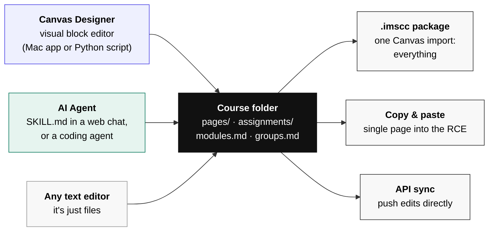

# Canvas Design Agent

Design Canvas LMS courses as plain files — **visually** with the Canvas Designer app, or **with an AI agent** working from a portable skill file — then import the whole course into Canvas in one step.

[Documentation Site](https://npuckett.github.io/canvas-design-agent/docs/) · [Canvas Designer app](https://npuckett.github.io/canvas-design-agent/docs/designer.html) · [Workflows](https://npuckett.github.io/canvas-design-agent/docs/workflows.html) · [Element Catalog](https://npuckett.github.io/canvas-design-agent/docs/elements.html) · [Download SKILL.md](https://npuckett.github.io/canvas-design-agent/docs/downloads/SKILL.md)

## Table of Contents

- [The Idea in One Diagram](#the-idea-in-one-diagram)
- [Method 1: Canvas Designer (Visual, No AI)](#method-1-canvas-designer-visual-no-ai)
- [Method 2: AI Agent + SKILL.md](#method-2-ai-agent--skillmd)
- [The Course Repo: The Shared Foundation](#the-course-repo-the-shared-foundation)
- [Publishing Into Canvas: Three Paths](#publishing-into-canvas-three-paths)
- [What's In This Repository](#whats-in-this-repository)
- [Quick Starts](#quick-starts)
- [Element Numbering System](#element-numbering-system)
- [Canvas Constraints (Summary)](#canvas-constraints-summary)
- [License](#license)

## The Idea in One Diagram

Canvas strips most CSS and many HTML elements — only inline `style=""` attributes and specific elements survive its Rich Content Editor. This project encodes what survives into a catalog of **51 elements and 7 themes**, then gives you two interchangeable ways to build with it. Both write the same **course folder** of plain text files, which builds into a one-shot Canvas import:


```mermaid
flowchart LR
    UI["<b>Canvas Designer</b><br/>visual block editor<br/>(Mac app or Python script)"] --> REPO
    AG["<b>AI Agent</b><br/>SKILL.md in a web chat,<br/>or a coding agent"] --> REPO
    TXT["<b>Any text editor</b><br/>it's just files"] --> REPO
    REPO["<b>Course folder</b><br/>pages/ · assignments/<br/>modules.md · groups.md"] --> OUT1["<b>.imscc package</b><br/>one Canvas import:<br/>everything"]
    REPO --> OUT2["<b>Copy &amp; paste</b><br/>single page into the RCE"]
    REPO --> OUT3["<b>API sync</b><br/>push edits directly"]

    style UI fill:#eef0fe,stroke:#4f46e5,color:#000
    style AG fill:#e6f4ef,stroke:#0d7a5f,color:#000
    style TXT fill:#f8f8f8,stroke:#999,color:#000
    style REPO fill:#111,stroke:#111,color:#fff
    style OUT1 fill:#f8f8f8,stroke:#333,color:#000
    style OUT2 fill:#f8f8f8,stroke:#333,color:#000
    style OUT3 fill:#f8f8f8,stroke:#333,color:#000
```

The two creation methods aren't rivals — they read and write the same files. Have an agent draft a semester and polish pages visually, or design one page you love and ask an agent to repeat it for every week.

## Method 1: Canvas Designer (Visual, No AI)

A free visual editor for whole Canvas courses. It feels like the Canvas page editor, with three upgrades: every block you insert is **guaranteed to survive the Canvas sanitizer**, your **whole course** is open at once, and assignment settings (points, due dates, grading) are a form beside the content.

- **[Download for Mac](https://github.com/npuckett/canvas-design-agent/releases/latest)** — signed and notarized DMG, Apple Silicon. Drag to Applications.
- **Any platform, no install** — the app is a shell around one dependency-free script that ships in every course repo:

  ```bash
  python3 tools/designer.py .
  ```

Features: click-to-insert palette of the full element library (with live themed previews), nested layout editing with breadcrumbs, theme switching, a custom style editor (saved to `styles.json`, which AI agents also honor), assignment settings forms, a deterministic Canvas-safety checker, new-course scaffolding, and a one-click `.imscc` build. Everything is local — no accounts, no cloud, no AI calls.

Full tour: **[Designer page](https://npuckett.github.io/canvas-design-agent/docs/designer.html)** · Technical notes: [tools/designer/README.md](tools/designer/README.md)

## Method 2: AI Agent + SKILL.md

**[SKILL.md](.github/SKILL.md)** is a portable instruction file containing the Canvas constraints, the numbered element library, and transformation rules. Any AI that reads it can turn plain course notes into Canvas-ready HTML. Two sizes:

### Web chat — single pages, zero setup

1. Paste the contents of [SKILL.md](docs/downloads/SKILL.md) into Microsoft Copilot, ChatGPT, or Claude (or upload the file). The top of the file tells the AI what to do; wait for its ready message.
2. Paste your course content in plain language — rough notes are fine.
3. Copy the **HTML source** it produces (not the rendered preview) into the Canvas RCE HTML view (`</>` icon).

### Coding agent in a course repo — whole courses

Open a [course repo](#the-course-repo-the-shared-foundation) in Claude Code, Cursor, or VS Code + Copilot. The repo's `CLAUDE.md` and `SKILL.md` teach the agent the rules automatically, and you work in plain language:

> "Create class pages for weeks 1–6 from my notes in notes.txt, using our course style."
>
> "Add Project 2: 100 points, letter grade, PDF upload, due Oct 30, under the Projects group."
>
> "Shift every due date after reading week one week later, then rebuild."

The agent writes one file per page/assignment; you review the diff, rebuild, re-import. [Prompt templates](docs/prompts/) show good input formats for common page types.

## The Course Repo: The Shared Foundation

Both methods work best on a **course repo**: one folder (ideally under git) holding your whole course as small text files. The repo — not Canvas — is the source of truth:

- **Customizations live in the repo** — `style.md` captures your theme and recurring sections; `styles.json` holds Designer-made custom styles; agents and the Designer both apply them, so every page is consistent.
- **Course-wide changes are cheap** — one sentence to an agent, or one theme switch in the Designer.
- **Next semester is a copy of the folder** with new dates.

Every `.md` file is **front matter (settings) + body (Canvas-safe HTML fragment)**:

```
my-course/
├── course.md          course title, code, timezone
├── style.md           your course's visual identity
├── styles.json        custom styles from the Designer (optional)
├── groups.md          grading scheme (weights, drop rules)
├── modules.md         week-by-week module structure
├── syllabus.md
├── assignments/       one .md file per assignment (points, due date + HTML)
├── pages/             one .md file per page
└── web_resources/     images/files shipped into Canvas
```

**Get one:** the Designer app's **New course** button scaffolds this structure, or start from the **[canvas-course-template](https://github.com/npuckett/canvas-course-template)** repository ("Use this template" on GitHub, or `npx degit npuckett/canvas-course-template my-course`). The template bundles the tools, the skill file, agent instructions, and the Designer script; its source of truth is [course-template/](course-template/) in this repo.

## Publishing Into Canvas: Three Paths

However you create content, three ways to get it into your course — documented step-by-step on the [Workflows page](https://npuckett.github.io/canvas-design-agent/docs/workflows.html):

1. **[Copy & Paste](https://npuckett.github.io/canvas-design-agent/docs/workflows.html#paste)** — paste one page's HTML into the Canvas RCE HTML view. No setup; assignment settings still clicked by hand.
2. **[Course Package Import](https://npuckett.github.io/canvas-design-agent/docs/workflows.html#package)** — build a `.imscc` with [tools/build_imscc.py](tools/build_imscc.py) (or the Designer's Build button) and import it via Settings → Import Course Content. Carries *everything*: pages, assignments with points/due dates/submission types/grading, weighted assignment groups, modules, syllabus, home page. Identifiers are stable, so re-imports **update in place** instead of duplicating. Needs no special permissions.
3. **[Direct API Sync](https://npuckett.github.io/canvas-design-agent/docs/workflows.html#api)** — push pages and assignments straight into Canvas with [tools/canvas_api_sync.py](tools/canvas_api_sync.py). Fully hands-off, but requires a Canvas access token (some institutions disable self-service tokens).

There's also the reverse direction: [tools/extract_imscc.py](tools/extract_imscc.py) turns an existing Canvas course export back into an editable course folder — bootstrap next semester's repo from this year's course.

## What's In This Repository

1. **[Canvas Designer](tools/designer.py)** — the visual editor: stdlib-only local server + [tools/designer/](tools/designer/) frontend, plus the [Mac app shell](app/) and its signed-release build pipeline. Releases on the [Releases page](https://github.com/npuckett/canvas-design-agent/releases).
2. **[SKILL.md](.github/SKILL.md)** — the portable AI instruction file (public download copy in [docs/downloads/](docs/downloads/)).
3. **[Course-building tools](tools/)** — dependency-free Python: `build_imscc.py`, `extract_imscc.py`, `canvas_api_sync.py`. Full format reference in [tools/README.md](tools/README.md); worked example in [tools/example-course/](tools/example-course/).
4. **[Course repo template](course-template/)** — source of truth for the [canvas-course-template](https://github.com/npuckett/canvas-course-template) starter repository.
5. **[Documentation site](docs/)** — the [reference site](https://npuckett.github.io/canvas-design-agent/docs/): Designer, workflows, element catalog, examples, downloads.
6. **[Prompt templates](docs/prompts/)** — markdown input examples for common Canvas page types.

## Quick Starts

**Visual, five minutes:** [download the Designer](https://github.com/npuckett/canvas-design-agent/releases/latest) → New course → insert blocks from the palette → Build → import the `.imscc` in Canvas (Settings → Import Course Content → Canvas Course Export Package).

**AI, five minutes:** download [SKILL.md](docs/downloads/SKILL.md) → paste it into Copilot/ChatGPT/Claude → paste your notes → copy the HTML into a Canvas page's HTML editor (`</>`).

**Managing a real course:** make a repo from [canvas-course-template](https://github.com/npuckett/canvas-course-template) → open it in your AI coding tool and/or the Designer → build with `python3 tools/build_imscc.py . -o dist/course.imscc` → import → re-import after edits to update in place.

## Element Numbering System

Elements are organized by category with a letter prefix. In the Designer they're the palette; with an AI you can reference them by ID ("use C01 for collapsible sections") or just describe what you want.

| Prefix | Category | Count |
|--------|----------|-------|
| L | Layout | 8 |
| C | Content Organization | 9 |
| T | Typography | 10 |
| D | Data Display | 7 |
| V | Visual Indicators | 6 |
| N | Navigation | 2 |
| X | Canvas Integration | 6 |
| E | External Media | 3 |
| S | Style Themes | 7 |
| F | Font Stacks | 5 |

Browse them all with live previews in the [Element Catalog](https://npuckett.github.io/canvas-design-agent/docs/elements.html).

## Canvas Constraints (Summary)

**Works (inline style only):** flexbox, grid, gradients, relative/absolute positioning, overflow, max-width centering, details/summary, mark, abbr, definition lists, all table features, audio/video controls.

**Stripped:** `<style>` blocks, `<script>`, SVG, meter/progress, fieldset/legend, box-shadow, text-shadow, opacity, transform, letter-spacing, external CSS/JS, data URIs.

See [SKILL.md](.github/SKILL.md) for the canonical constraint reference. The Designer enforces these by construction; its safety checker and the skill's output checks guard hand-written HTML.

## License

[Creative Commons Attribution-NonCommercial-ShareAlike 4.0 International](LICENSE) (CC BY-NC-SA 4.0)

Free to use, share, and adapt for academic and non-commercial purposes. Attribution required. Derivatives must use the same license. Commercial use is not permitted.
